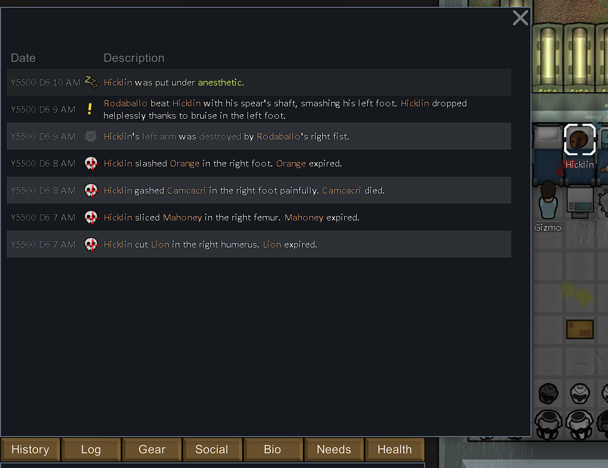

# PawnHistory

This mod expands RimWorld's storytelling aspect by tracking important pawn events during their life on the rim.
It watches for significant colonist-related incidents, then turns them into flavorful narrative records.

It also backdates selected generator-time records. When RimWorld creates an older pawn with things like scars, royal milestones, bonded persona weapons, or mechlinks all at the spawn tick, PawnHistory redistributes those supported records earlier across the pawn's life so the log reads like lived history instead of a same-second dump.

## Data flow

```
[Harmony Patch] ← EventContext (tracking more complex state to create event data)
    ↓
GameEventBus.Publish(GameEvent)
    ↓
(Event received)
    ↓
Recorder (map event → domain object) → Recorder.Register() → subscribes to events on start up
    ↓
CreateRecord(input) (filter, generate description) ← Simulator (external trigger)
    ↓
AddRecord() (factory)
    ↓
HistoryCompManager → HistoryRecord[]
```

## Implementing a recorder

A **Recorder** is the core logic unit responsible for:

- Subscribing to events
- Filtering relevant pawns
- Producing history records

Start by defining a new `HistoryRecordDef`:

```xml
<Defs>
  <!-- other defs... -->
	<HistoryRecordDef Class="PawnHistory.Source.PawnTracker.HistoryRecordDef">
		<defName>Anesthetized</defName>
		<label>anesthetized</label>
		<description>{PAWN} was put under {ANESTHETIC}.</description>
		<icon>EventIcons/Sleep</icon>
		<categories>
			<li>Health</li>
		</categories>
	</HistoryRecordDef>
</Defs>
```

Register it in code:

```c#
[DefOf]
public class HistoryRecordDefOf
{
    public static HistoryRecordDef Anesthetized;
    // ...
}
```

If the event does not already exist, create one using Harmony patch. Before adding a new event,
check the `Events/` folder for the full list of supported events first. Here is an example:

```cs
public record HediffAddedEvent(Pawn Pawn, Hediff Hediff, BodyPartRecord Part, DamageInfo? Dinfo) : GameEventBase;

[HarmonyPatch(typeof(Pawn_HealthTracker), nameof(Pawn_HealthTracker.AddHediff), [typeof(Hediff), typeof(BodyPartRecord), typeof(DamageInfo?), typeof(DamageResult)])]
internal class Pawn_HealthTracker_AddHediff_Patch
{
    static void Postfix(Pawn_HealthTracker __instance, Hediff hediff, BodyPartRecord part, DamageInfo? dinfo, DamageResult result)
    {
        var pawn = PawnRef(__instance);
        GameEventBus.Publish(new HediffAddedEvent(pawn, hediff, hediff.Part, dinfo));
    }
}
```

Create a Recorder for the event. The `Register()` method is called automatically at startup.
Use `ShouldRecord()` to filter for the kinds of pawns currently supported by the mod.

```c#
using RimWorld;
using Verse;

namespace PawnHistory.Source.PawnTracker.Recorders;

internal class HediffRecorder : RecorderBase<HediffAddedEvent>
{
    public override void Register()
    {
        GameEventBus.Subscribe<HediffAddedEvent>(e =>
        {
            if (e.Hediff.def == HediffDefOf.Anesthetic)
                CreateRecord(e);
        });
    }

    public override void CreateRecord(HediffAddedEvent e)
    {
        if (!ShouldRecord(e.Pawn))
            return;

        var desc = HistoryRecordDefOf.Anesthetized.Description(pawn)
            .AddRule("ANESTHETIC", hediff)
            .Format();

        AddRecord(HistoryRecordDefOf.Anesthetized, pawn, desc);
    }
}
```



## Testing

PawnHistory is shipped with an internal test framework to ease up the work of setting up the world for testing any [recorder](#implementing-a-recorder), Core components:

- `XyzBuilder` like `MapBuilder`, `PawnBuilder`, `ThingBuilder`...: used together to construct a scenario for testing. they are often created through `TestScenario` class:

```c#
public class TestScenario
{
    public PawnBuilder Pawn(int count = 1) => new(count);
    public PawnBuilder Pawn(IEnumerable<Pawn> pawns) => new PawnBuilder().WithPawns(pawns);
    public PawnBuilder Pawn(Pawn pawn) => Pawn([pawn]);
    public GatheringBuilder Incident(GatheringDef def) => new(def);
    public IncidentBuilder Incident(IncidentDef def) => new(def);
    public MapBuilder Map(IntVec3? pos = null) => new(pos);
    public ThingBuilder Thing(ThingDef thingDef) => new(thingDef);
   // ...
```

- `TestManager`: Coordinates execution of multiple tests in sequence and creates a test report.
- `TestContext` (internal): context for the current running test: number of passed/failed assertions, ongoing delayed assertions..
- `SkipTestAttribute`, `DebugValuesAttribute`: Customization for test method.
- `Expect`, `PawnHistoryAssertions`: Create matchers and assertions.
- `RecorderManager`: Provides debug buttons to scan and run all tests or any specific test.

## Writing test

To write a test case for your recorder, create a method that starts with `Test`:

```c#
internal class HediffRecorder : RecorderBase
{
    public override void Register() { /* ... */ }
    public override void CreateRecord(HediffAddedEvent e) { /* ... */ }

    public void Test(TestScenario scenario)
    {
        var patient = scenario.Pawn()
            .ThatMatches(ShouldRecord)
            .ThatMatches(p => p.health.hediffSet.hediffs.All(h => h.def != HediffDefOf.Anesthetic))
            .AddHediff(HediffDefOf.Anesthetic)
            .CreateSingle();

        Expect.That(patient).ToHaveHistoryRecord("[PAWN] was put under anesthetic.");
    }

    public void TestInvert(TestScenario scenario)
    {
        var patient = scenario.Pawn()
            .ThatMatches(ShouldRecord)
            .FullHeal()
            .CreateSingle();

        Expect.That(patient).Not().ToHaveHistoryRecordOf(HistoryRecordDefOf.Anesthetized);
    }
}
```

### Run all tests

- Enable Development Mode
- Open: Debug Actions Menu
- Navigate to: Pawn History → Run All Tests

### Run a specific recorder test

- Enable Development Mode
- Open: Debug Actions Menu
- Navigate to: Pawn History → Recorder Tests… → `[Recorder Name]`
